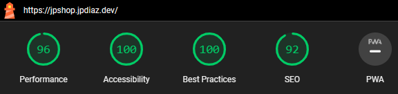

# Jp·Shop: A React-powered online store for a seamless shopping experience

<!--  -->

Jp·Shop is a fully responsive online store that leverages the power of React, Vite.js, Tailwind CSS, and React Router DOM to deliver a seamless shopping experience. It's a modern, sleek, and efficient web application that allows users to view products, filter by category, and purchase orders with ease.

Jp·Shop has a login feature that allows users to sign in and access additional content, such as their account and previous orders. This feature mimics the workflow and functionality of a real login page, but it does not actually authenticate users.

It also has a Skeleton Loading feature that provides a better user experience by showing a loading animation while the content is being fetched. This feature ensures that users are aware that the content is loading and reduces the perceived loading time.

It has a shopping cart feature that allows users to add products to their cart and proceed to checkout. The application is fully integrated with the Dummy API, ensuring that users get the latest and greatest products.

Jp·Shop is not just an interface; it's an experience. ️It's simple, stylish, and fast, making online shopping a breeze.

## Description 📝

This project is a fully responsive web application that allows users to:

- View a wide range of products.
- Filter products by category.
- Add products to their shopping cart.
- Proceed to checkout and complete their purchase.
- Sign in and access their account (mimicking real login functionality without authentication).

## Desktop Screenshots 🖥️

### Lighthouse Score 🚀

## Features:

- Responsive design: Jp·Shop adapts to any screen size, ensuring a consistent and enjoyable shopping experience for all users.
- Sleek and modern UI: Tailwind CSS provides a beautiful and intuitive user interface, making it easy for users to find what they're looking for.
- Efficient and performant: Vite.js ensures fast loading times and a smooth shopping experience.
- Product categories: Users can easily browse through different product categories to find what they need.
- Shopping cart: Add and remove items from your cart with ease.
- Dummy API integration: Stay up-to-date with the latest products through the integrated Dummy API.
- Login functionality (mimicked): Experience the login process without actual authentication.
- Skeleton loading: Enjoy a better user experience with loading animations while content is being fetched.
- Dropdown menu: Easily navigate through different product categories.

### Built With 🔑

Welcome to Jp·Shop, a modern, sleek, and efficient online store built with React, Vite.js, Tailwind CSS, and React Router DOM.

React: for a seamless user experience. Vite.js: for lightning-fast development and performance. Tailwind CSS: for sleek and efficient design. React Router DOM: for effortless navigation. API Integration: ensuring you get the latest and greatest products.

Here's a closer look at the tech stack:

- Front-End: React.js, Vite.js, Tailwind CSS
- Back-End: API Integration (RESTful)
- Deployment: Vercel

## Get started 🛠️

To get started with Jp·Shop, simply clone the repository and follow the setup instructions. You'll be up and running in no time!

## Contribution 🤝

All contributions are welcome. Please read the [CONTRIBUTING guidelines](CONTRIBUTING.md) for details on our code of conduct, and the process for submitting pull requests.

### Contributors

<!-- Made with [contrib.rocks](https://contrib.rocks). -->

## License 📜

Jp·Shop is licensed under the MIT License.

We hope you enjoy using Jp·Shop!

## Contact 📞

<!-- ACKNOWLEDGMENTS -->

## Acknowledgments 📚

Resources list that I find helpful and would like to give credit to.

- [React Documentation](https://reactjs.org/docs/getting-started.html)
- [Vite.js Documentation](https://vitejs.dev/guide/)
- [Tailwind CSS Documentation](https://tailwindcss.com/docs)
- [React Router DOM Documentation](https://reactrouter.com/web/guides/quick-start)
- [Platzi](https://platzi.com/)
